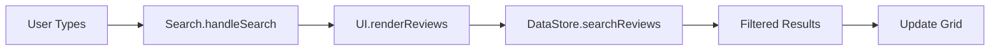

## Overview

Reseñas Gastronómicas provides powerful search and filtering capabilities to help you quickly find specific reviews. This guide covers all available search methods and best practices.

## Search Methods

The application offers two primary ways to find reviews:

1. **Text Search** - Search across restaurants, dishes, and review content
2. **Restaurant Filters** - Filter by specific restaurants with one click

## Text Search

<Steps>
  <Step title="Access the Search Bar">
    The search input is prominently displayed at the top of the reviews section with a search icon.

    ```html
    <!-- From public/index.html:39 -->
    <input type="text" id="searchInput" 
           placeholder="Busca por restaurante, plato o reseña..." 
           class="w-full pl-10 pr-4 py-3 border border-gray-300 rounded-xl" />
    ```
  </Step>

  <Step title="Enter Search Terms">
    Type your search query directly into the search box. The search is **real-time** - results update as you type.

    ### Search Behavior

    The search function examines multiple fields:
    - Restaurant names
    - Dish names  
    - Review text from both reviewers

    ```javascript
    // From src/js/modules/datastore.js:82-89
    searchReviews(query) {
        if (!query) return this.reviews;

        const searchTerm = query.toLowerCase();
        return this.reviews.filter(review =>
            review.restaurant.toLowerCase().includes(searchTerm) ||
            review.dish.toLowerCase().includes(searchTerm) ||
            Object.values(review.reviewers).some(reviewer =>
                reviewer.review.toLowerCase().includes(searchTerm)
            )
        );
    }
    ```

    <Note>
    Search is **case-insensitive** and uses **partial matching**, so searching for "pizza" will find "Pizza Margherita".
    </Note>
  </Step>

  <Step title="Review Results">
    The reviews grid automatically updates to show only matching results. The search looks for your query anywhere in the searchable fields.

    ### Real-Time Updates

    ```javascript
    // From src/js/modules/search.js:14-24
    handleSearch(query) {
        this.currentQuery = query.trim();
        const clearBtn = document.getElementById('clearSearch');

        if (this.currentQuery) {
            clearBtn.classList.remove('hidden');
        } else {
            clearBtn.classList.add('hidden');
        }

        UI.renderReviews();
    }
    ```

    The search automatically:
    - Shows the clear button when text is entered
    - Hides reviews that don't match
    - Maintains filter selections
  </Step>

  <Step title="Clear Search">
    Click the **X** button that appears in the search field to clear your search and show all reviews.

    ```javascript
    // From src/js/modules/search.js:27-32
    clearSearch() {
        document.getElementById('searchInput').value = '';
        this.currentQuery = '';
        document.getElementById('clearSearch').classList.add('hidden');
        UI.renderReviews();
    }
    ```
  </Step>
</Steps>

## Restaurant Filters

<Steps>
  <Step title="Locate Filter Buttons">
    Restaurant filter buttons appear below the search bar. The application dynamically generates buttons for all unique restaurants in your reviews.

    ```javascript
    // From src/js/modules/filters.js:18-22
    filtersContainer.innerHTML = restaurants.map(restaurant =>
        `<button data-filter="${Utils.escapeHtml(restaurant)}" 
                class="filter-btn px-4 py-2 rounded-full text-sm font-medium">
            ${Utils.escapeHtml(restaurant)}
        </button>`
    ).join('');
    ```
  </Step>

  <Step title="Select a Restaurant">
    Click any restaurant button to filter reviews to only that restaurant. The selected button is highlighted with a gradient background.

    ```javascript
    // From src/js/modules/filters.js:29-41
    filterByRestaurant(restaurant) {
        this.currentFilter = restaurant;

        document.querySelectorAll('.filter-btn').forEach(btn => {
            btn.classList.remove('active');
        });

        const activeBtn = document.querySelector(`[data-filter="${restaurant}"]`);
        if (activeBtn) {
            activeBtn.classList.add('active');
        }

        UI.renderReviews();
    }
    ```

    <Tip>
    The **Todos** (All) button is always available to show reviews from all restaurants.
    </Tip>
  </Step>

  <Step title="View Filtered Results">
    The reviews grid updates to show only reviews from the selected restaurant. All other reviews are hidden.

    ### Filter Styling

    ```css
    /* From src/css/styles.css:59-62 */
    .filter-btn.active {
        background: linear-gradient(to right, #9333ea, #db2777);
        color: white;
    }
    ```

    Active filters are visually distinct with a purple-to-pink gradient.
  </Step>
</Steps>

## Combining Search and Filters

You can use text search and restaurant filters **simultaneously** for more precise results.

### Example Workflow

<Steps>
  <Step title="Filter by Restaurant">
    Click "El Emperador" to see only reviews from that restaurant.
  </Step>

  <Step title="Search Within Results">
    Type "pasta" in the search box to find only pasta dishes at El Emperador.
  </Step>

  <Step title="Refine Further">
    The system applies both filters together, showing the intersection of results.
  </Step>
</Steps>

<Note>
Filters and search work together multiplicatively - results must match BOTH the filter and search criteria.
</Note>

## Advanced Search Techniques

### Searching by Reviewer

Since search includes review text, you can find reviews mentioning specific terms:

```plaintext
Search: "crispy" → Finds all reviews where Gian or Yami mentioned crispiness
Search: "picante" → Finds reviews discussing spice level
Search: "porción grande" → Finds reviews mentioning portion sizes
```

### Finding High-Rated Items

While there's no rating filter in the UI, you can:
1. Search for superlatives: "increíble", "excelente", "perfecto"
2. Look at the average rating displayed on each card
3. Check the statistics panel for top-rated restaurants

### Empty Search Results

If no reviews match your search:
- The reviews grid appears empty
- Try broader search terms
- Check for typos
- Clear filters to expand results

## Filter Management

The filter system is **self-updating** based on your reviews:

```javascript
// From src/js/modules/datastore.js:75-77
getRestaurants() {
    return [...new Set(this.reviews.map(r => r.restaurant))];
}
```

### Dynamic Filter Updates

- **Adding a new restaurant**: Filter button appears automatically
- **Deleting all reviews from a restaurant**: Filter button is removed
- **Editing restaurant names**: Filters update to reflect changes

<Warning>
Changing a restaurant name in a review will affect filtering. Ensure consistent naming to avoid splitting reviews across multiple filters.
</Warning>

## Search Performance

The search implementation is **client-side** and optimized for real-time responsiveness:

### Performance Characteristics

<CardGroup cols={2}>
  <Card title="Instant Results" icon="bolt">
    Search executes on every keystroke with no delay
  </Card>
  
  <Card title="No Network Calls" icon="wifi">
    All filtering happens locally in the browser
  </Card>
  
  <Card title="Scalable" icon="chart-line">
    Performs well with hundreds of reviews
  </Card>
  
  <Card title="Responsive" icon="mobile">
    Works smoothly on mobile devices
  </Card>
</CardGroup>

## Search Data Flow

Here's how search queries flow through the application:



1. **Input event** triggered on search field
2. **Search module** captures and stores query
3. **UI module** requests filtered reviews
4. **DataStore** applies search logic
5. **Results** rendered to grid

## Keyboard Shortcuts

While not explicitly implemented, standard browser behaviors work:

- **Tab** - Navigate to search field
- **Escape** - Clear search field (browser default)
- **Ctrl/Cmd + F** - Browser find (searches visible text)

## Best Practices

<AccordionGroup>
  <Accordion title="Use Specific Terms">
    Search for dish names ("ceviche") rather than generic terms ("comida") for better results.
  </Accordion>

  <Accordion title="Start Broad, Then Narrow">
    Begin with a restaurant filter, then use search to find specific dishes or reviews.
  </Accordion>

  <Accordion title="Try Variations">
    If a search fails, try:
    - Singular vs plural ("taco" vs "tacos")
    - Different spellings
    - Related terms
  </Accordion>

  <Accordion title="Clear Filters Between Searches">
    Click "Todos" to reset restaurant filters when starting a new search.
  </Accordion>
</AccordionGroup>

## Troubleshooting

### Search Not Working

**Symptoms**: Typing in search box doesn't filter results

**Solutions**:
- Refresh the page to reinitialize JavaScript
- Check browser console for errors
- Verify Search module is initialized in app.js:24
- Clear browser cache

### Filters Missing

**Symptoms**: No restaurant filter buttons appear

**Solutions**:
- Ensure you have added at least one review
- Check that reviews have restaurant names
- Verify Filters.update() is called after adding reviews
- Inspect the `#restaurantFilters` element in DevTools

### Search Results Unexpected

**Symptoms**: Search shows irrelevant results

**Solutions**:
- Remember search includes review text, not just titles
- Check for the search term in reviewer comments
- Verify search is case-insensitive
- Clear any active restaurant filters

## Next Steps

<CardGroup cols={2}>
  <Card title="Add Reviews" icon="plus" href="/guides/adding-reviews">
    Create more reviews to get the most from search and filters
  </Card>
  
  <Card title="Customize Interface" icon="palette" href="/guides/customization">
    Personalize colors and styles for your review system
  </Card>
</CardGroup>